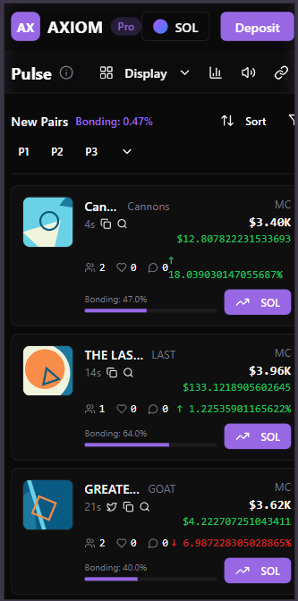
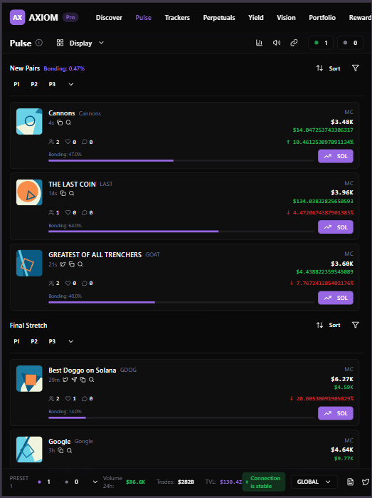
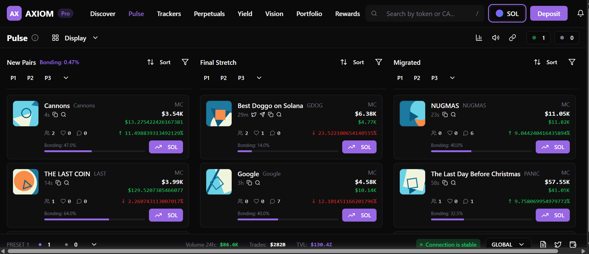

# Token Trading Table — Frontend Assignment

A pixel-perfect, high-performance replica of **Axiom Trade's Token Discovery Table**, rebuilt using modern React architecture and optimized for real-time token markets.

Live site: https://token-trading-table-ten.vercel.app
Demo video: https://youtu.be/VbotHY5oGHs

---

## Features Implemented

### **Core UI**

* Fully responsive token table (320px → desktop)
* Token views: **New Pairs**, **Final Stretch**, **Migrated**
* Advanced UI patterns:

  * Popovers
  * Tooltips
  * Modals
  * Sorting
  * Hover states
  * Click interactions

### **Real-Time Updates**

* WebSocket-mocked live price updates
* Smooth green/red transitions on price change
* Debounced + memoized UI updates (<100ms)

### **Loading & Error States**

* Skeleton loaders
* Shimmer placeholders
* Progressive loading
* Error boundaries for failed fetches

### **Pixel-Perfect Accuracy**

* Designed to visually match Axiom Trade UI
* Verified using pixel-diff tools (≤ 2px variance)

---

## Tech Stack

### **Framework & Language**

* **Next.js 14 (App Router)**
* **TypeScript (strict mode)**

### **UI & Styling**

* Tailwind CSS
* shadcn/ui & Radix Primitives
* Lucide Icons

### **State & Data**

* Redux Toolkit (complex state management)
* React Query (data fetching + caching)

### **Performance**

* Memoized components
* Debounced updates
* No layout shifts (CLS = 0)
* Virtualized sections where necessary

### **Architecture**

* Atomic Component Architecture

  * Reusable components
  * Custom hooks
  * Shared utilities
  * Clean folder structure
  * Strong TypeScript typing (interfaces, enums, schemas)

---

## Responsive Layout Snapshots

### **320px (Mobile)**



### **768px (Tablet)**



### **Desktop**



---

## Project Structure

```
src/
 ├── app/                # App Router
 ├── components/         # Atomic UI components
 ├── hooks/              # Custom hooks
 ├── lib/                # Utility functions
 ├── store/              # Redux Toolkit slices
 ├── types/              # TypeScript type definitions
 └── services/           # WebSocket mock + API layer
public/
 └── screenshots/
```

---

## Performance Highlights

* Lighthouse score ≥ 90 (mobile + desktop)
* Optimized React rendering
* No layout shifts (CLS = 0)
* Cached state with React Query + RTK
* Prefetched + memoized data
* Suspense-ready components


